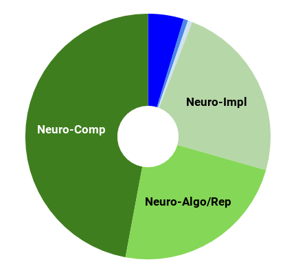
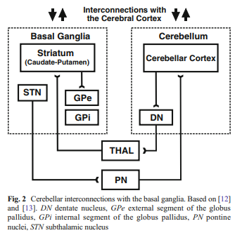

---

layout: post

title:  The Cerebello-basal ganglia-thalamo-cortical system

---

_This post is part of a series "Systems Neuroscience for AI: An Introductory Guide to the Literature"._

#### Guide contents
* [Introduction]()
* [Motivation: why should we pay attention to the brain for AI?]()
* [Overviews: What, broadly speaking, is the brain computing?]() 
* [The Cerebral Cortex: A Very Tangled Web]()
* [The Thalamus: More than just Central Station]()
* [The Hippocampus: A Less Tangled Web]()
* [Cortico-hippocampal interactions]()
* [Reinforcement Learning with the Basal Ganglia and prefrontal cortex]()
* [The Telencephalon: Or, How I Learned Concepts in the Cortico-thalamo-basal ganglia-hippocampal system]()
* [The ‘Little Brain’, often forgotten: the Cerebellum]()
* [The Cerebello-basal ganglia-thalamo-cortical system]() (This page)
* [Conclusions]()

 

---

 

In this cut-throat reductionist world, I’d have expected better of the cerebellar community, itself no stranger to exclusion, than to marginalise the lowly thalamus by omitting it from the title of the next review. This elision notwithstanding, this consensus paper collects together a wide range of perspectives on the interactions between four major brain areas. On occasion, it even speculates on hippocampal involvement. While all sections paint a picture that is valuable for our purposes{link}, of particular note is Kenji Doya’s section, which gives an update on his review from 2000 that we encountered in the earlier ‘Overviews’ section{link} of this guide. We will see that the cerebellum might generally improve the quality of our internal world models. As such, some of the AI architectures that query world models for imagination and planning discussed in the Telencephalon section{link}, could equally be compared with the cerebello-basal ganglia-thalamocortical system. 

<h3 markdown='1' style="color:#515A5A">
Consensus Paper: Towards a Systems-Level View of Cerebellar Function: the Interplay Between Cerebellum, Basal Ganglia, and Cortex

</h3>

Daniele Caligiore, Giovanni Pezzulo, Gianluca Baldassarre, Andreea C. Bostan, Peter L. Strick, Kenji Doya, Rick C. Helmich, Michiel Dirkx, James Houk, Henrik Jörntell, Angel Lago-Rodriguez, Joseph M. Galea, R. Chris Miall, Traian Popa, Asha Kishore, Paul F. M. J. Verschure, Riccardo Zucca, Ivan Herreros 
Cerebellum 16: 203.(2017)  
https://doi.org/10.1007/s12311-016-0763-3 
 
**Abstract** 

Despite increasing evidence suggesting the cerebellum works in concert with the cortex and basal ganglia, the nature of the reciprocal interactions between these three brain regions remains unclear. This consensus paper gathers diverse recent views on a variety of important roles played by the cerebellum within the cerebello-basal ganglia-thalamo-cortical system across a range of motor and cognitive functions. The paper includes theoretical and empirical contributions, which cover the following topics: recent evidence supporting the dynamical interplay between cerebellum, basal ganglia, and cortical areas in humans and other animals; theoretical neuroscience perspectives and empirical evidence on the reciprocal influences between cerebellum, basal ganglia, and cortex in learning and control processes; and data suggesting possible roles of the cerebellum in basal ganglia movement disorders. Although starting from different backgrounds and dealing with different topics, all the contributors agree that viewing the cerebellum, basal ganglia, and cortex as an integrated system enables us to understand the function of these areas in radically different ways. In addition, there is unanimous consensus between the authors that future experimental and computational work is needed to understand the function of cerebellar-basal ganglia circuitry in both motor and non-motor functions. The paper reports the most advanced perspectives on the role of the cerebellum within the cerebello-basal ganglia-thalamo-cortical system and illustrates other elements of consensus as well as disagreements and open questions in the field.  

_Next post_: [Conclusions]({{ site.baseurl }}/Systems_Neuroscience_for_AI_Conclusions/)

