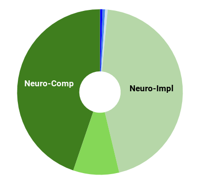
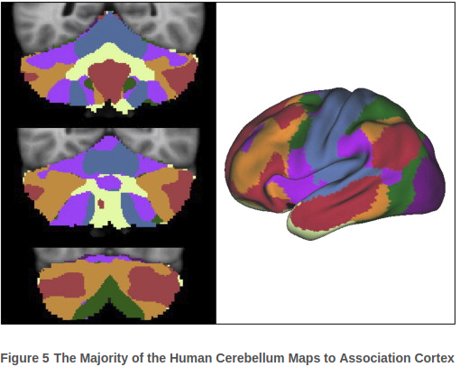
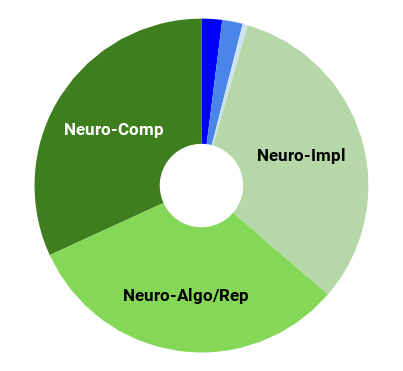
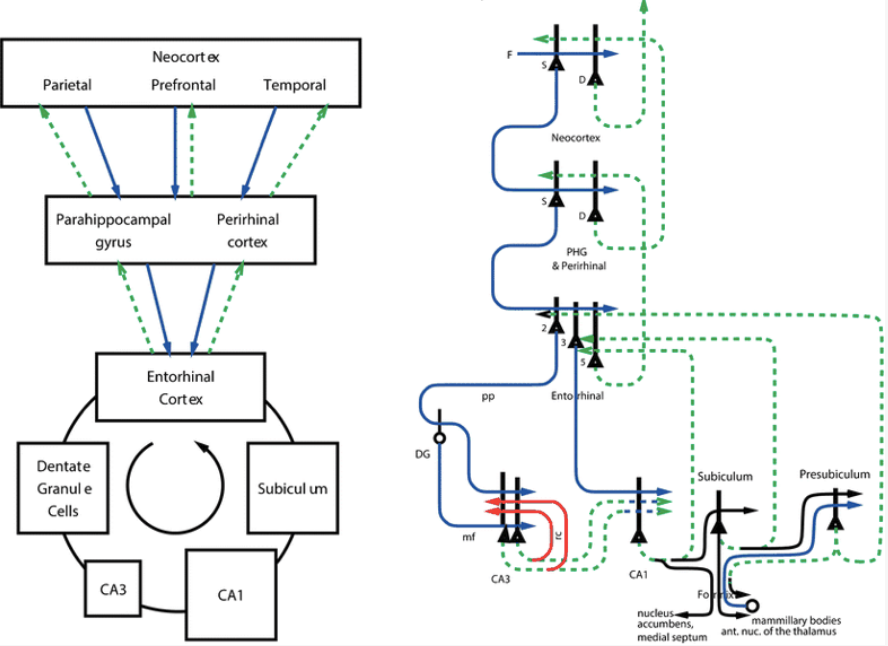

---

layout: post

title:  The ‘Little Brain’, often forgotten&#58; The Cerebellum

---

_This post is part of a series "Systems Neuroscience for AI: An Introductory Guide to the Literature"._

#### Guide contents
* [Introduction]()
* [Motivation: why should we pay attention to the brain for AI?]()
* [Overviews: What, broadly speaking, is the brain computing?]() 
* [The Cerebral Cortex: A Very Tangled Web]()
* [The Thalamus: More than just Central Station]()
* [The Hippocampus: A Less Tangled Web]() (This page)
* [Cortico-hippocampal interactions]()
* [Reinforcement Learning with the Basal Ganglia and prefrontal cortex]()
* [The Telencephalon: Or, How I Learned Concepts in the Cortico-thalamo-basal ganglia-hippocampal system]()
* [The ‘Little Brain’, often forgotten: the Cerebellum]()
* [The Cerebello-basal ganglia-thalamo-cortical system]()
* [Conclusions]()

 

---

 

Traditional view of the cerebellum is that it refines movement. Given that so much valuable neuroscience had to be excluded from the guide, why then should such a limited brain region get a whole section? A modern view of the cerebellum affords it a much broader role, including in cognition. Before addressing this role with respect to the systems treated in previous sections, we must first consider it in isolation.

As a brief primer on on the well-studied circuitry and basic function of the cerebellum, I recommend this 10 minute video.

<h3 markdown='1' style="color:#515A5A">
The Cerebellum and Cognitive Function: 25 Years of Insight from Anatomy and Neuroimaging

</h3>

Vol 80, Issue 3, p807-815, 30 October 2013 
Randy L. Buckner 
https://doi.org/10.1016/j.neuron.2013.10.044  
 

**Abstract** 
Twenty-five years ago the first human functional neuroimaging studies of cognition discovered a surprising response in the cerebellum that could not be attributed

 to motor demands. This controversial observation challenged the well-entrenched view that the cerebellum solely contributes to the planning and execution of movement. Recurring neuroimaging findings combined with key insights from anatomy and case studies of neurological patients motivated a reconsideration of the traditional model of cerebellar organization and function. The majority of the human cerebellum maps to cerebral association networks in an orderly manner that includes a mirroring of the prominent cerebral asymmetries for language and attention. These findings inspire exploration of the cerebellum’s contributions to a diverse array of functional domains and neuropsychiatric disorders.  

There is a good reason Demis Hassabis chose to study the hippocampus for his doctoral thesis: the hippocampus is implicated in a striking array of cognitive phenomena. Not only is it thought to enable one shot learning, but Hassabis et al. also rightly predicted its role in imagination of new experiences (Hassabis et al. 2007). New experiences are not so different from new concepts, and it happens that the hippocampal cells appear to be able to represent semantically meaningful concepts such as “Jennifer Aniston” or of particular places. It is not a major leap, therefore, to suppose that the hippocampus also has a role in the imagination not just of new experiences, but also of new concepts (later showed by Kumaran et al. 2009), a function that is central to human-level creative intelligence. The hippocampus has also been found to implement a form of ‘experience replay’ in a way that improved performance in a goal-directed learning task and in a way that predicted the path the rat subsequently navigated. It seems clear that the hippocampus is involved in the manipulation of an internal world model. Before dissecting that claim, we need to take a look at the hippocampus in isolation. 

In contrast to the cortex, the hippocampus is a comparatively well understood part of the brain on the implementational, algorithmic, and computational level. Of course, important details continue to be discovered, but it is probably fair to say that are less confused about what is happening in the hippocampus than in the cortex. As discussed in the reviews, Marr provided the canonical view of the hippocampus’s computations: pattern separation (through random orthogonal projection) and pattern completion (through autoassociation). We will see in the reviews that it might also be viewed as a content addressable memory.

Edmund Rolls has produced a long series of incrementally updating reviews that are the among the most illuminative introductions to the computations of the hippocampus. We will return to its possible role in imagination of new concepts in the section on the interaction between the hippocampus and the cortex. 

<h3 markdown='1' style="color:#515A5A">
The storage and recall of memories in the hippocampo-cortical system 
</h3>

Cell and Tissue Research (2018) 373:577–604 
Edmund T. Rolls 
https://doi.org/10.1007/s00441-017-2744-3  
 
**Abstract**
 
_A quantitative computational theory of the operation of the hippocampus as an episodic memory system is described. The CA3 system operates as a single attractor or autoassociation network (1) to enable rapid one-trial associations_ 

_between any spatial location (place in rodents or spatial view in primates) and an object or reward and (2) to provide for completion of the whole memory during recall from any part. The theory is extended to associations between time and object or reward to implement temporal order memory, which is also important in episodic memory. The dentate gyrus performs pattern separation by competitive learning to create sparse representations producing, for example, neurons with place-like fields from entorhinal cortex grid cells. The dentate granule cells generate, by the very small number of mossy fibre connections to CA3, a randomizing pattern separation effect that is important during learning but not recall and that separates out the patterns represented by CA3 firing as being very different from each other. This is optimal for an unstructured episodic memory system in which each memory must be kept distinct from other memories. The direct perforant path input to CA3 is quantitatively appropriate for providing the cue for recall in CA3 but not for learning. The CA1 recodes information from CA3 to set up associatively learned backprojections to the neocortex to allow the subsequent retrieval of information to the neocortex, giving a quantitative account of the large number of hippocampo-neocortical and neocortical-neocortical backprojections. Tests of the theory including hippocampal subregion analyses and hippocampal NMDA receptor knockouts are described and support the theory._
 
 
Associated talks:
<ul>
<li>https://youtu.be/pLxMRI6ZOe0</li>
<li>https://www.youtube.com/watch?v=dGVKayyxE34</li>
</ul>

Although among my favourite reviews, we will address a couple of shortcomings of the Rolls (2018) review in the section on the corticothalamic-basal ganglia-hippocampal system (or, more succinctly, ‘the telencephalon’). For now, we turn to some of the AI architectures inspired by the system. 

A large number Memory Augmented Neural Networks (MANNs) have been proposed to circumvent some of the shortcomings of traditional neural networks, especially catastrophic forgetting and low memory capacity. One recent example is Kaiser et al (2017), who combine a differentiable memory module with several seq-to-seq models for one shot learning. There already exists at least one good blog post comparing the Differentiable Neural Computer (DNC) and biological memory, so I will not discuss that angle in detail here, except to emphasise one crucial difference between the DNC and hippocampus. Like traditional deep networks, the parameters of the memory in the DNC require training by backpropagation and the system must learn when and what to write to memory, which can initially be slow and unstable (It should be noted, however, that once they are trained, writing may be fast). Learning in the hippocampus appears to be less parametric, less dependent on what is already ‘written’ there. Therefore, it is plausible that non-parametric architectures such as the episodic controller (Blundell et al. 2016) or neural cache (Grave et al. 2016) (a variant of which was used in Rae et al. 2018, which employed a Hebbian learning rule, a biologically plausible learning rule not often seen in modern deep learning!) might map more easily onto what we know about hippocampal function. Ultimately, however, the fidelity of the mapping is secondary to functional requirements. We will return to these architectures (and others) later when treating the interactions between the hippocampus, cortex, thalamus, and basal ganglia. 

Now that we’ve built an understanding of the roles of the corticothalamic system and hippocampus in isolation, we can start to explore in detail some of the exciting ways in which they might interact. 

_Next post_: [Cortico-hippocampal interactions]({{ site.baseurl }}/Systems_Neuroscience_for_AI_Cortico-hippocampal_interactions/)

