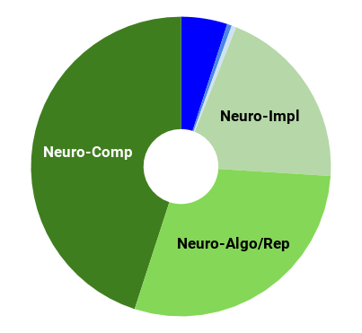
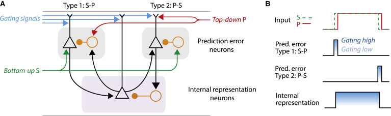
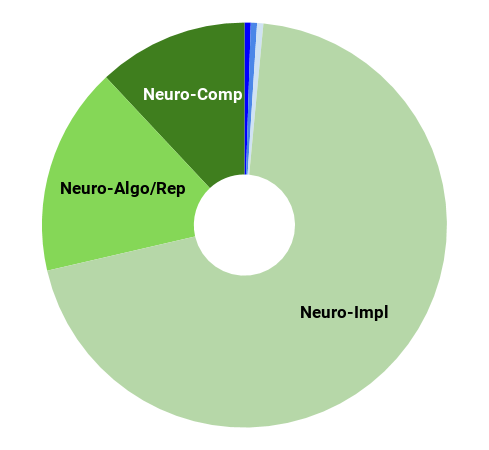
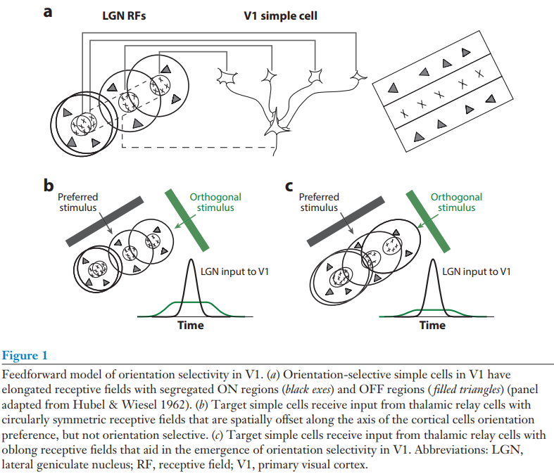

---

layout: post

title:  The Cerebral Cortex&#58; A Very Tangled Web 

---

_This post is part of a series "Systems Neuroscience for AI: An Introductory Guide to the Literature"._

#### Guide contents
* [Introduction]()
* [Motivation: why should we pay attention to the brain for AI?]()
* [Overviews: What, broadly speaking, is the brain computing?]() 
* [The Cerebral Cortex: A Very Tangled Web]() (This page)
* [The Thalamus: More than just Central Station]()
* [The Hippocampus: A Less Tangled Web]()
* [Cortico-hippocampal interactions]()
* [Reinforcement Learning with the Basal Ganglia and prefrontal cortex]()
* [The Telencephalon: Or, How I Learned Concepts in the Cortico-thalamo-basal ganglia-hippocampal system]()
* [The ‘Little Brain’, often forgotten: the Cerebellum]()
* [The Cerebello-basal ganglia-thalamo-cortical system]()
* [Conclusions]()

 

---

 

One of the striking things about the cortex is that a brain region with such a stereotyped structural motif (further details in the reviews below) also appears to be instrumental in such varied functions as seeing, hearing, understanding language, speaking, moving, planning, making moral and economic decisions, and more. It is easy to see why the cortex attracts such scientific attention, aside from its being relatively easy to access experimentally. As such, this (most?) prized and multifarious brain region demands a more detailed treatment in the guide: this section will be longer and more discursive than most, and later we will also look in more detail at other areas of the cortex that interact with specific brain areas and systems. 

## Some advisory notes on the cortex
Let me save you some time. Possibly a lot of time. 

Navigating the cortical literature, you’ll hear a lot of talk about the canonical cortical circuit, but does it even exist? Once a majority view, today the debate is more diverse, reflecting the diversity of microcircuitry found in the cortex. Whatever the outcome of the debate, there is an agreement of a structural similarity on some level: at very least, the cortex has a clear layered structure and there are some common structural motifs within that structure. We will leave the debate on how functionally meaningful is cortical heterogeneity to the biologists. While the specific details of cortical anatomy and physiology remain mysterious, several principles of cortical computation have emerged. As with systems neuroscience as a whole, focusing on these principles, rather than their specific implementation, will be more useful for our purposes{link}.

The next advisory note is not so much a debate, but flags a conceptual relic left over from a time when we didn’t know any better. You’ll read researchers talking about the ‘cortical column’, purportedly the functional unit of cortical computation which spans its layers vertically. But the circuit-level anatomy of a column lacks observational evidence, and a universally accepted definition of columns does not exist. da Costa and Martin (2010) discuss the origin of the confusion and why it endures.

The extraordinary scientific attention received by the cortex, and the messiness of the object, comes at a cost to the inductee. When it comes to research on the ‘cortical algorithm’, it is extremely difficult to extract the signal from the noise. We will therefore avoid wading too deep into that swamp - but we will dip our toes. It will in any case be useful to have a rough idea of the basic cortical circuitry that many review authors take for granted. For our purposes, a sufficient introduction of the canonical cortical circuitry can be found in this 13 minute video; many of the gaps left by this video will be filled in in the reviews that follow. We will look in more detail at the cortex on the computational level of analysis in the section after this advisory note, and on the implementational level of analysis in section that follows.  

Despite the attention it receives, we do not truly know how close we are to understanding the cortex. Consider an analogous set of challenges: imagine being tasked with understanding an LSTM having no prior knowledge of similar RNNs. This might be achievable, given that a human once generated the idea. But try doing the same for an LSTM with a million hidden, noisy and probabilistic activations, fast weights, attention, internal feedforward layers, feedback, all looking only at few neurons at once; also every neuron is a neural network in itself and has 10’000 inputs and neurons have a tendency to die or might change their behaviour when you poke them to study them; and also you need to get ethical approval (justifiably) to conduct experiments, which limits your sample size. You can see why it’s hard to extract a global picture from experiments that face such challenges. 

## The cortex: what is it computing? 
It is now widely known, even to many outside neuroscience, that the visual cortex extracts a hierarchy of visual features, starting with edge detectors and building up to the recognition of entire objects. Other sensory areas also appear to build similar hierarchies of their sensory modality. Given the similarity of the circuit, it is natural to assume that the same fundamental computations explain the representations of cortical areas that are harder to interpret, such as those involved in decision-making. By what mechanism were such features extracted? And more broadly, what is the cortex doing?

Probably the most widely accepted single candidate theory is the predictive coding hypothesis, which contends that the canonical cortical computation is prediction. Prediction provides an appropriate cost function to perform unsupervised learning; indeed, for an arbitrarily powerful learning algorithm, it is not clear what the limits are on the features that may be extracted by learning to predict future inputs. 

In this review, Keller and Mrsic-Flogel give an overview of the set of theories they collect together to call ‘predictive processing’, and what the behavioural benefits of predictive processing might be. They suggest components of a predictive processing algorithm that neuroscientists should expect to find if the cortex is implementing predictive process and review the current evidence for the existence of those algorithmic components.

<h3 markdown='1' style="color:#515A5A">
[Predictive Processing: A Canonical Cortical Computation.](httks://doi.org/10.1016/j.neuron.2018.10.003)
</h3>

Neuron. 2018 Oct 24;100(2):424-435.  
Keller GB, Mrsic-Flogel TD  
httks://doi.org/10.1016/j.neuron.2018.10.003  
 
 
 

**Abstract**
_This perspective describes predictive processing as a computational framework for understanding cortical function in the context of emerging evidence, with a focus on sensory processing. We discuss how the predictive processing framework may be implemented at the_
 
 _level of cortical circuits and how its implementation could be falsified experimentally. Lastly, we summarize the general implications of predictive processing on cortical function in healthy and diseased states._
 

 
 

---

 
Prediction is probably not the only primary category of cortical computation, but being poorly understood, there are few reviews of current consensus toward which to point the inductee. We will not discuss the many other canonical cortical computations thought to be performed by the cortex (of which there is no universally recognised set) except briefly to highlight:
* Sparsification: The by-now-well-known discovery that primary visual cortex cells form similar representations to those found using Independent Component Analysis (ICA) on natural image patches illustrates this well enough. Since biological neural networks often make use of winner-takes-all dynamics that enforce sparsity, I point the reader toward the winner-takes-all autoencoder (Makhzani & Frey 2015), which in my (qualitative) view demonstrates a powerful learning rule for the extraction of meaningful features. Veering back to the biology, Singer et al (2018) showed that sparsified and predictive representations of auditory signals are also consistent with those found in the primary auditory cortex. Since we have a lot of ground to cover, the straightforward argument that the cortex is computing sparse predictive representations needn’t be laboured with a review, though feel free to check out Singer et al (2018) if you seek more information on this point.
* Computation of selectivity and computation of gain, as argued in Canonical computations of cerebral cortex. (Miller, 2016)
* Six principles for biologically based computational models of cortical cognition. O’Reilly (1998), which presents classic but lasting criticisms of the standard feedforward neural network with backpropagation as a model of cortical cognition. 

## Where is each cortical function computed, or do we care? 
For our purposes{link}, it is not particularly enlightening to learn the anatomical name or location of the cortical area that computes a particular function or representation; that information may be useful for biologists, but tells us little with regard to how intelligence is organised. Nevertheless, it would be remiss not to discuss anything about the global organisation of the cortex. Given the complexity of the brain, it might be surprising that the relative locations of functional areas of cortex is fundamentally quite easy to predict, conditional on knowing the locations its most basic inputs and outputs. To understand this heuristic to cortical layout, we’ll first reformulate the problem. 

We start with a few assumptions: 
* Treat the computation network of the cortex as a directed cyclic graph where each computational unit (whether that be a cell, a ‘column’, a microcircuit, a large functional region, or other) is a node
* Assume each node learn a predictive model of its inputs. 
* Assume its the output of the predictive model is used as input to other nodes. 
* Assume that there are costs associated with the length of the edges that connect these nodes. These costs may derive from, for example:
  - Metabolic costs of maintaining longer connections,
  - Computational inaccuracies in longer connections due to signal latency or degradation,
  - The difficulty of genetically guiding a longer developmental path
* Lastly, assume that the above costs cannot be kept small by placing all computational models into a point or small sphere due to spatial constraints; they must exist on a single folded sheet. 
The result is that computational units that are most useful for predicting (or representing) a particular feature will be found closest to that feature. In general, the more useful for prediction (or representation) a feature is, the more likely it is that it be found nearby to the computational unit predicting (or representing) that feature. With these assumptions, and with knowledge of the basic inputs to the cortex (from the other brain areas and from the senses, which we will explore in the reviews in this guide) and its outputs, the functional topography of the cortex makes a lot of sense (I’m informed, with recommendation, that similar arguments to these are detailed in the book Principles of Neural Design (2015), although I have not read the book myself). Below, some specific examples are given: 

* Topographic maps in primary sensory or motor cortices appear to maintain the topology of the inputs or outputs according to the above principles. For example, retinotopic maps are useful because of spatial locality of the input data - predicting/representing one area of the retina can easily make use of information in adjacent areas. Similarly for the somatosensory homunculus. Another example: the primary motor cortex locates the hand and head beside each other since these two body parts commonly require coordination together. Since somatosensory information is useful for movement, the somatosensory and motor homunculi tend to map to each other across the postcentral sulcus. (picture)
* The representational hierarchies of single sensory modalities are computed in contiguous 'blocks' instead of being computed in fragmented locations. The association cortices, which use features learned from multiple modalities, are situated in the middle of these unimodal cortices. 
* Related functions are computed in nearby places. For example, object distinction in the inferotemporal cortex{link} is close to the fusiform face area{link}, since facial recognition is a very similar task to object recognition. Wernicke’s area{link} (speech recognition) is located close to the auditory cortex{link}, fusiform face area{link}, and the ventral visual stream{link}, which processes movements, in this case possibly the observed lip movements of a speaker.
* The motor cortex (M1 and M2){link} is adjacent to the motor planning areas of the cortex (Supplementary motor area{link} and premotor area{link}), which are adjacent to areas involved in long term planning and abstract reasoning (e.g. dorsolateral PFC{link}). The dorsolateral PFC is also adjacent to the OFC{link}, which represents the values of states, information that will be useful in deciding actions. I’ll point out here that if we assume the relationships between cortical areas are based on prediction (as opposed to simply representation, which is a weaker constraint), the ‘predictive graph framework’ only works if you assume that the PFC is somehow predicting the action that the motor cortex will take. I haven’t yet understood how that’s supposed to work, but some well-respected researchers have nevertheless bitten that bullet. 
This list is far from exhaustive; you should notice deeper examples as you read about the functions and inputs of different areas of cortex throughout this guide. There are of course exceptions to this notion, as with everything in biology: Long range projections between distant brain areas (and indeed between hemispheres) of course exist, but observations of the layout of the cortex appear to suggest there are forces that minimise these distances. 

Before we proceed to the next aspect of canonical cortical computation, a caveat: I don’t advise taking the view that the human infant cortex is a tabula rasa that completely self-organises through learning-by-prediction (or, more weakly, “-by-representation”). It would be extremely surprising if evolution employed no genetic hard-coding of the cortical topographic map that facilitated learning of particular functions. However, while hard coding is probably used to a degree, the plasticity of the cortex to learn arbitrary input (e.g. the A1 cortex learning to represent the visual receptive fields typically seen in V1 when given visual input (Roe et al. 1992)) suggests that the cortex is at least capable of learning these graphical structures, even if it might use non-minimal genetic help to increase the ease by which they are learned in the infant. See Zador (2019) for arguments supportive of non-minimal genetic hard-coding, as well as for counterpoints against the thesis that AI has many lessons left to learn from neuroscience.

### The cortex: How does it compute? Nobody knows. Yet.
We barely even know what might be important for understanding the cortical algorithm, never mind how it works. It made sense, therefore, to start with studying one part of the cortex rather than trying to understand it as a whole. As a result, neuroscience has focused significant efforts on the primary visual and primary somatosensory cortices. Taking these limited areas, the next sensible thing to do is to try to understand how the simplest representation emerges. The following article reviews exactly that: what we know about how orientation selectivity emerges in the primary visual cortex. While I found this among the most informative reviews of the cortex, we are still far from a macroscopic, algorithmic-level understanding, and as such the review attends to the implementation level of the biology more than the average review in this guide; those wishing to stay as far away as possible from the implementation level may wish to skip this review.

<h3 markdown='1' style="color:#515A5A">
[Mechanisms of Orientation Selectivity in the Primary Visual Cortex](https://doi.org/10.1146/annurev-vision-111815-114456)

</h3>

Annual Review of Vision Science Vol. 2:85-107 (October 2016)  
Nicholas J. Priebe  
https://doi.org/10.1146/annurev-vision-111815-114456  
 
**Abstract**

_The mechanisms underlying the emergence of orientation selectivity in the visual cortex have been, and continue to be, the subjects of intense scrutiny. Orientation selectivity reflects a dramatic change in the representation of the visual world: Whereas afferent thalamic neurons are generally orientation insensitive, neurons in the primary visual cortex (V1) are extremely sensitive to stimulus orientation. This profound change in the receptive field structure along the visual pathway has positioned V1 as a model system for studying the_

 _circuitry that underlies neural computations across the neocortex. The neocortex is characterized anatomically by the relative uniformity of its circuitry despite its role in processing distinct signals from region to region. A combination of physiological, anatomical, and theoretical studies has shed some light on the circuitry components necessary for generating orientation selectivity in V1. This targeted effort has led to critical insights, as well as controversies, concerning how neural circuits in the neocortex perform computations._

 

---

 

One of the arguments highlighted by Hassabis et al. (2016) and Ganguli (2018), presented in the 'Motivations' section{link}, is that neuroscience and AI provide a good source of priors for each other. A possible example of this is Costa et al. (2017), which attempts to map cortical circuitry onto a variant of the LSTM. While I don’t place a lot of probability mass on the specific thesis article being correct, it is a relevant and recent example of inter-field crosstalk and how the two fields can yield meaningful hypotheses for each other. 

These are only the beginning of our encounters with the cortex. Being such an important area for both representing and interacting with the world, almost all future sections will involve the cortex and its interactions with other brain areas. Our next stop is at the cortex’s gateway, the brain part through which almost all input to the cortex must pass: the thalamus.

_Next post_: [The Thalamus: More than just Central Station]({{ site.baseurl }}/Systems_Neuroscience_for_AI_Thalamus/)

