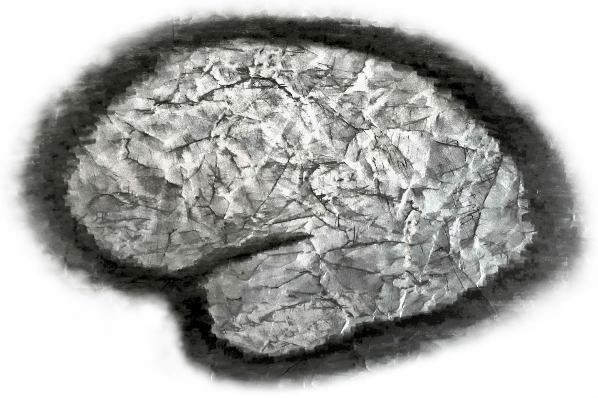

---

layout: post

title:  Systems Neuroscience for AI&#58; Conclusions

---

_This post is part of a series "Systems Neuroscience for AI: An Introductory Guide to the Literature"._

#### Guide contents
* [Introduction]()
* [Motivation: why should we pay attention to the brain for AI?]()
* [Overviews: What, broadly speaking, is the brain computing?]() 
* [The Cerebral Cortex: A Very Tangled Web]()
* [The Thalamus: More than just Central Station]()
* [The Hippocampus: A Less Tangled Web]()
* [Cortico-hippocampal interactions]()
* [Reinforcement Learning with the Basal Ganglia and prefrontal cortex]()
* [The Telencephalon: Or, How I Learned Concepts in the Cortico-thalamo-basal ganglia-hippocampal system]()
* [The ‘Little Brain’, often forgotten: the Cerebellum]()
* [The Cerebello-basal ganglia-thalamo-cortical system]()
* [Conclusions]() (This page)

 

---

 

If you have been following along by reading the reviews, we have now come a long way. In spite of the ground covered here, we have left untouched entire brain components such as the amygdala and claustrum to name only two. Nevertheless, you should now have a very broad picture of what is happening and where in the brain - at least enough to serve as an informed springboard from which you can dive into the literature that you think will be most useful for inspiring progress in AI. However, systems neuroscience is unlikely to be the only conceptual toolkit needed to build useful general intelligence. For that, other research agendas have much to contribute. To name just a few promising new areas : multiagent learning and complex environments (a compelling manifesto for which can be found in Leibo et al. (2019)); abstract reasoning and symbolic computation in neural systems; ‘core’ ML topics such as improvements to optimisation algorithms or probabilistic deep learning; automated architecture search; and, orthogonally (but no less importantly), how we can build a general intelligence that actually does what we want it to and does it safely. These agendas should be seen as complementary to the systems neuroscience-centred agenda, rather than as contradictory.

Despite our ignorance, and despite having only a skeleton-frame perspective, we have seen how systems neuroscience provides a rational and useful framework around which we can build our mental models of intelligence. Now, using this framework, let us go out and improve our mental and physical models of general intelligence.

 
