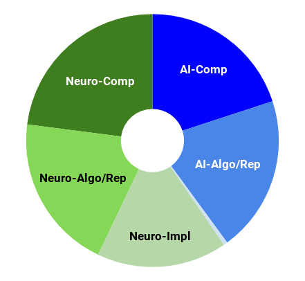
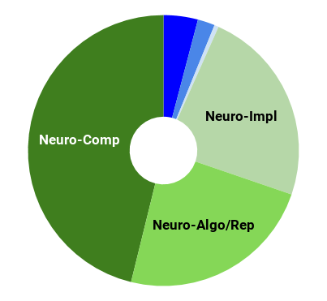
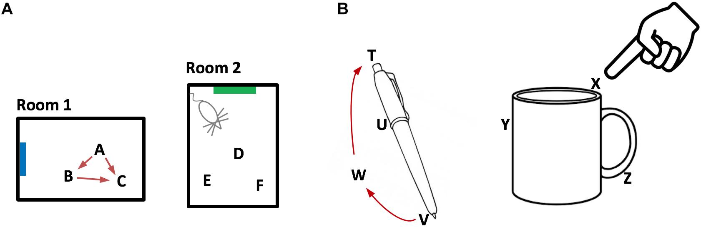
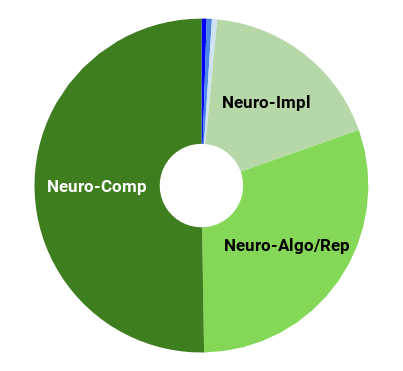
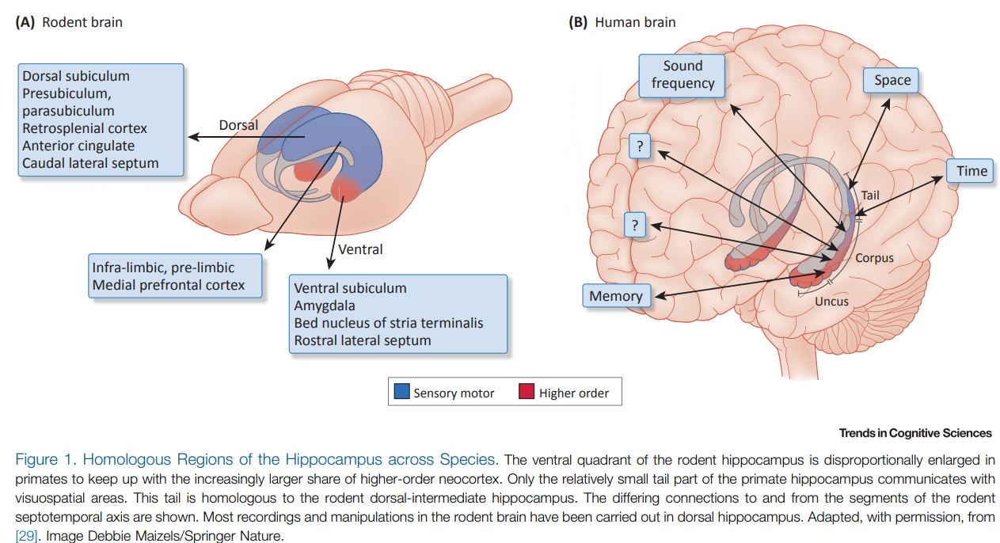

---

layout: post

title:  Cortico-hippocampal Interactions 

---

_This post is part of a series "Systems Neuroscience for AI: An Introductory Guide to the Literature"._

#### Guide contents
* [Introduction]({{ site.baseurl }}/Systems_Neuroscience_for_AI_Introduction/)
* [Motivation: why should we pay attention to the brain for AI?]({{ site.baseurl }}/Systems_Neuroscience_for_AI_Motivation/)
* [Overviews: What, broadly speaking, is the brain computing?]({{ site.baseurl }}/Systems_Neuroscience_for_AI_Overviews/)
* [The Cerebral Cortex: A Very Tangled Web]({{ site.baseurl }}/Systems_Neuroscience_for_AI_Cerebral_Cortex/)
* [The Thalamus: More than just Central Station]({{ site.baseurl }}/Systems_Neuroscience_for_AI_Thalamus/)
* [The Hippocampus: A Less Tangled Web]({{ site.baseurl }}/Systems_Neuroscience_for_AI_Hippocampus/)
* [Cortico-hippocampal interactions]({{ site.baseurl }}/Systems_Neuroscience_for_AI_Cortico-hippocampal_interactions/) (This page)
* [Reinforcement Learning with the Basal Ganglia and prefrontal cortex]({{ site.baseurl }}/Systems_Neuroscience_for_AI_RL_with_BG_and_PFC/)
* [The Telencephalon: Or, How I Learned Concepts in the Cortico-thalamo-basal ganglia-hippocampal system]({{ site.baseurl }}/Systems_Neuroscience_for_AI_Telencephalon/)
* [The ‘Little Brain’, often forgotten: the Cerebellum]({{ site.baseurl }}/Systems_Neuroscience_for_AI_Cerebellum/)
* [The Cerebello-basal ganglia-thalamo-cortical system]({{ site.baseurl }}/Systems_Neuroscience_for_AI_CB_BG_Th_Ctx/)
* [Conclusions]({{ site.baseurl }}/Systems_Neuroscience_for_AI_Conclusions/)
 

---

 

The combined discovery of place cells and grid cells got the judges at the Karolinska Institute so excited that it was the subject of the 2014 Nobel prize in physiology or medicine. As a refresher, place cells are cells in the hippocampus that individually activate if the animal (a rat in the original experiment) is in a particular location. Grid cells are cells that individually activate in multiple places, defined in a hexagonal grid-like pattern. One of my favourite single findings in computational neuroscience is that non-negative PCA performed on place cell activations yields ‘nonnegative principal components’ that have a hexagonal grid-like spatial pattern ([Dordek et al. 2016](https://doi.org/10.7554/eLife.10094)). [Cueva and Wei (2018)](https://arxiv.org/abs/1803.07770) and DeepMind ([Banino et al. 2018](https://www.nature.com/articles/s41586-018-0102-6))(or see the [blog post](https://deepmind.com/blog/grid-cells/) for a concise overview) independently replicated this observation in artificial agents, the latter arguing that this representation enables extremely efficient vector-based navigation. These findings have led to some interesting theories of cognition that take aim at a large scale explanation of the corticohippocampal system, including the following perspective from Behrens et al. (2018)(below) that we build grid-cell like codes for abstract, conceptual spaces. 

<h3 markdown='1' style="color:#515A5A">
[What Is a Cognitive Map? Organizing Knowledge for Flexible Behavior](https://doi.org/10.1016/j.neuron.2018.10.002)

</h3>

Volume 100, Issue 2, 24 October 2018, Pages 490-509 
Timothy Behrens, Timothy Muller, James Whittington, Shirley Mark, Alon Baram, Kimberly Stachenfeld, and Zeb Kurth-Nelson 
https://doi.org/10.1016/j.neuron.2018.10.002 
 
**Abstract** 

It is proposed that a cognitive map encoding the relationships between entities in the world supports flexible

 behavior, but the majority of the neural evidence for such a system comes from studies of spatial navigation. Recent work describing neuronal parallels between spatial and non-spatial behaviors has rekindled the notion of a systematic organization of knowledge across multiple domains. We review experimental evidence and theoretical frameworks that point to principles unifying these apparently disparate functions. These principles describe how to learn and use abstract, generalizable knowledge and suggest that map-like representations observed in a spatial context may be an instance of general coding mechanisms capable of organizing knowledge of all kinds. We highlight how artificial agents endowed with such principles exhibit flexible behavior and learn map-like representations observed in the brain. Finally, we speculate on how these principles may offer insight into the extreme generalizations, abstractions, and inferences that characterize human cognition.  

 

---

 
You can find a related argument in Hawkins et al. (2019)(below) which leans even more heavily on the notion of movement, even in representational domains beyond spatial navigation. 

<h3 markdown='1' style="color:#515A5A">
[A Framework for Intelligence and Cortical Function Based on Grid Cells in the Neocortex](https://doi.org/10.3389/fncir.2018.00121)

</h3>

Front. Neural Circuits, 11 January 2019 
Jeff Hawkins, Marcus Lewis, Mirko Klukas, Scott Purdy and Subutai Ahmad 
https://doi.org/10.3389/fncir.2018.00121 
 
**Abstract** 

How the neocortex works is a mystery. In this paper we propose a novel framework for understanding its function. 

Grid cells are neurons in the entorhinal cortex that represent the location of an animal in its environment. Recent evidence suggests that grid cell-like neurons may also be present in the neocortex. We propose that grid cells exist throughout the neocortex, in every region and in every cortical column. They define a location-based framework for how the neocortex functions. Whereas grid cells in the entorhinal cortex represent the location of one thing, the body relative to its environment, we propose that cortical grid cells simultaneously represent the location of many things. Cortical columns in somatosensory cortex track the location of tactile features relative to the object being touched and cortical columns in visual cortex track the location of visual features relative to the object being viewed. We propose that mechanisms in the entorhinal cortex and hippocampus that evolved for learning the structure of environments are now used by the neocortex to learn the structure of objects. Having a representation of location in each cortical column suggests mechanisms for how the neocortex represents object compositionality and object behaviors. It leads to the hypothesis that every part of the neocortex learns complete models of objects and that there are many models of each object distributed throughout the neocortex. The similarity of circuitry observed in all cortical regions is strong evidence that even high-level cognitive tasks are learned and represented in a location-based framework.  
Associated talks: https://www.youtube.com/watch?v=zVGQeFFjhEk

 

---

 

At risk of overloading the reader with an excess of spicy new takes on the entorhinal cortex-hippocampus system, I include the following review for completeness. While the above two reviews looked at the cortico-hippocampal representations with respect to semantics and space respectively, the next review examines the representations of the hippocampus with respect to time. Buszaki argues here that the hippocampus (in conjunction with the entorhinal cortex) is best viewed as a pattern generator, responsible for “producing sequential content free structure to access and organize sensory experiences distributed across cortical modules.”

<h3 markdown='1' style="color:#515A5A">
[Space and Time: The Hippocampus as a Sequence Generator.](https://doi.org/10.1016/j.tics.2018.07.006)

</h3>

Trends Cogn Sci. 2018 Oct;22(10):853-869. 
Buzsáki G, Tingley D. 
https://doi.org/10.1016/j.tics.2018.07.006 
 
**Abstract** 

Neural computations are often compared to instrument-measured distance or duration, and such relationships are interpreted by a human observer. However, neural circuits do not depend on human-made instruments but perform computations 

relative to an internally defined rate-of-change. While neuronal correlations with external measures, such as distance or duration, can be observed in spike rates or other measures of neuronal activity, what matters for the brain is how such activity patterns are utilized by downstream neural observers. We suggest that hippocampal operations can be described by the sequential activity of neuronal assemblies and their internally defined rate of change without resorting to the concept of space or time.  

 

---

 
This is far from the limit of interesting literature on cortico-hippocampal interactions, but brevity forces us to move on. Before we do, I highlight in passing
* **The Successor Representation: Its Computational Logic and Neural Substrates ([Gershman 2018](https://doi.org/10.1523/JNEUROSCI.0151-18.2018))** which gives an account of an emerging view of the specific types of representation encoded in the hippocampus, the successor representation. 
* **Episodic Memory and Beyond: The Hippocampus and Neocortex in Transformation ([Moscovitch et al. 2016](https://doi.org/10.1146/annurev-psych-113011-143733))** which looks at the topic from a wider range of views than in the above reviews, primarily from the psychological perspective. 
* **Approximate Hubel-Wiesel Modules and the Data Structures of Neural Computation ([Leibo et al. 2015](https://arxiv.org/abs/1512.08457))**, which is an attempt to unify, on the computational and algorithmic level, the computations of the hippocampus and the neocortex. 

If the hippocampus is where we instantiate or at least organise our imagination and novel thoughts as well as our recall, how do we choose what to call into imagination or to recall? We’re approaching a systems level of goal-directed behaviour, where we might consider ‘memory selection’ or ‘concept-for-imagination selection’ as a behaviour that is optimised by some policy. Before tackling the system that coordinates these functions (where we’ll look at the combination of the hippocampus, the thalamus, and the cortex) we should first address the system that coordinates goal-directed behaviour: the reinforcement learning system. 

_Next post_: [Reinforcement Learning with the Basal Ganglia and prefrontal cortex]({{ site.baseurl }}/Systems_Neuroscience_for_AI_RL_with_BG_and_PFC/)

