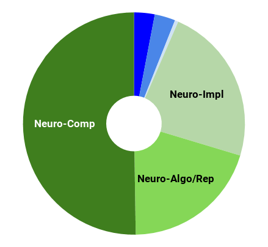
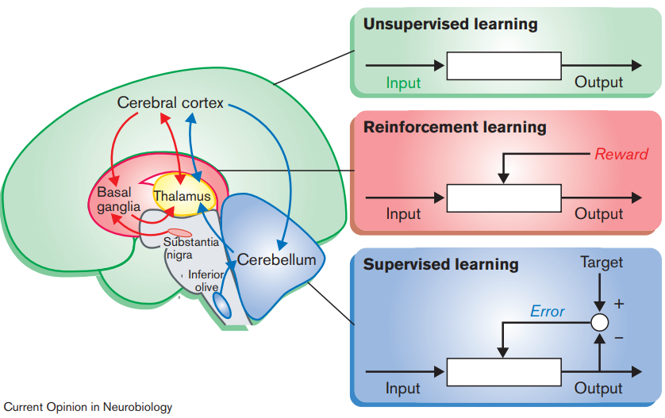
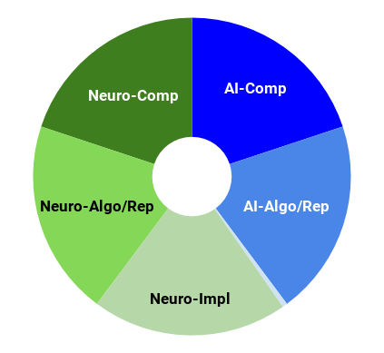
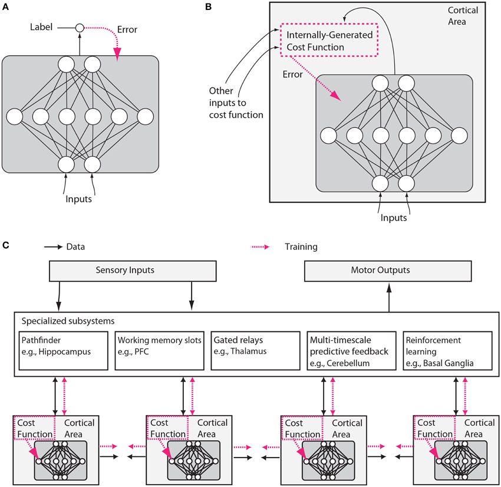

---

layout: post

title: Systems Neuroscience for AI 

---

_This post is part of a series "Systems Neuroscience for AI: An Introductory Guide to the Literature"._

#### Guide contents
* [Introduction]()
* [Motivation: why should we pay attention to the brain for AI?]()
* [Overviews: What, broadly speaking, is the brain computing?]() (This page)
* [The Cerebral Cortex: A Very Tangled Web]()
* [The Thalamus: More than just Central Station]()
* [The Hippocampus: A Less Tangled Web]()
* [Cortico-hippocampal interactions]()
* [Reinforcement Learning with the Basal Ganglia and prefrontal cortex]()
* [The Telencephalon: Or, How I Learned Concepts in the Cortico-thalamo-basal ganglia-hippocampal system]()
* [The ‘Little Brain’, often forgotten: the Cerebellum]()
* [The Cerebello-basal ganglia-thalamo-cortical system]()
* [Conclusions]()

## Overviews: What, broadly speaking, is the brain computing?

Going forward, it will be helpful to have a broad overview of the computational organisation of the brain. For this reason, despite its age (being by far the oldest review selected for this guide), the following short review by Kenji Doya (2000) gives a view of the computational-level function of three important areas in the brain - the cerebral cortex, the cerebellum, and the basal ganglia, and assigns to them unsupervised learning, supervised learning, and reinforcement learning respectively. Even if the true picture isn’t as clean as this perspective implies, it provides a straightforward conceptual framework around which further ideas can be built. 

<h3 markdown='1' style="color:#515A5A">
[Complementary roles of basal ganglia and cerebellum in learning and motor control](https://doi.org/10.1016/S0959-4388(00)00153-7)

</h3>

 
Current Opinion in Neurobiology 2000, 10:732–739 
Kenji Doya 
https://doi.org/10.1016/S0959-4388(00)00153-7 
 
 
 
 
 

**Abstract** 
_The classical notion that the basal ganglia and the cerebellum are dedicated to motor control has been challenged by the accumulation of evidence revealing their involvement in non-motor, cognitive functions. From a computational viewpoint, it has been suggested that the cerebellum, the basal ganglia, and the cerebral cortex are specialized for different types of learning: namely, supervised learning, reinforcement learning and unsupervised learning, respectively. This idea of learning-oriented specialization is helpful in understanding the complementary roles of the basal ganglia and the cerebellum in motor control and cognitive functions. 
 

Associated talks: https://youtu.be/iJeuZ7Q2Tk0 
(Note: This talk from_ Canonical Computation in Brains and Machines 2018 _gives an updated overview of Doya’s perspectives on large scale function of the brain. Highly recommended.)_

 

---

 
 

Now familiar with the idea that different parts of the brain are performing different types of computation, the perspective that the brain computes a number of different specific cost functions should come as no surprise. While the specifics of how the brain represents, computes, and minimises these cost functions remain elusive, much of the progress that has been made in this regard in the years since Doya (2000) is discussed by Marblestone et al. (2016). Specifically, they discuss this progress with respect to recent, complementary advances in deep learning, but the jury is still out on exactly how similar the algorithms of deep learning are to the brain’s own learning mechanisms. Marblestone et al. (2016) is the only selected review that discusses inter alia biologically plausible learning rules, and includes discussion on the contentious issue of backpropagation in the brain. This neuroscientific claim is very much not consensus and it should be remarked that the view receives a considerably better reception in the world of machine learning than in the world of neuroscience (according to Blake Richards, who works on the topic). Nevertheless, at very least, backprop seems like a appropriate source of inspiration in the search for the true learning rule(s), even if ends up being a scientific dead-end. 

<h3 markdown='1' style="color:#515A5A">
[Toward an Integration of Deep Learning and Neuroscience](https://doi.org/10.3389/fncom.2016.00094)

</h3>
 

Front. Comput. Neurosci., 14 September 2016
 
Adam H. Marblestone, Greg Wayne and Konrad P. Kording
 
https://doi.org/10.3389/fncom.2016.00094
 
 
 
 
 
 
 

**Abstract**
 
Neuroscience has focused on the detailed implementation of computation, studying neural codes, dynamics and circuits. In machine learning, however, artificial neural networks tend to eschew precisely designed codes, dynamics or circuits in favor of brute force optimization of a cost function, often using simple and relatively uniform initial architectures. Two recent developments have emerged within machine learning that create an opportunity to connect these seemingly divergent perspectives. First, structured architectures are used, including dedicated systems for attention, recursion and various forms of short- and long-term memory storage. Second, cost functions and training procedures have become more complex and are varied across layers and over time. Here we think about the brain in terms of these ideas. We hypothesize that (1) the brain optimizes cost functions, (2) the cost functions are diverse and differ across brain locations and over development, and (3) optimization operates within a pre-structured architecture matched to the computational problems posed by behavior. In support of these hypotheses, we argue that a range of implementations of credit assignment through multiple layers of neurons are compatible with our current knowledge of neural circuitry, and that the brain's specialized systems can be interpreted as enabling efficient optimization for specific problem classes. Such a heterogeneously optimized system, enabled by a series of interacting cost functions, serves to make learning data-efficient and precisely targeted to the needs of the organism. We suggest directions by which neuroscience could seek to refine and test these hypotheses.

_Next post_: [The Cerebral Cortex: A Very Tangled Web]({{ site.baseurl }}/Systems_Neuroscience_for_AI_Cerebral_Cortex/)
