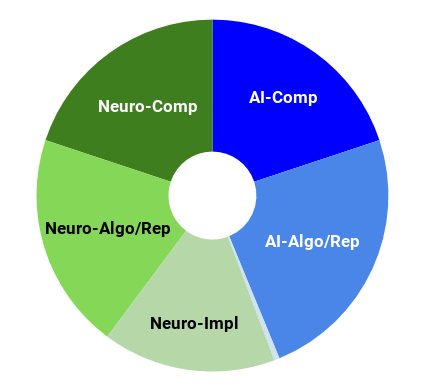
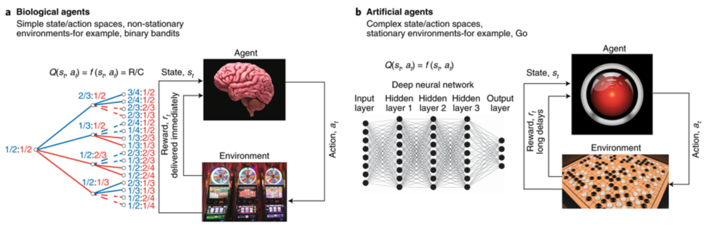
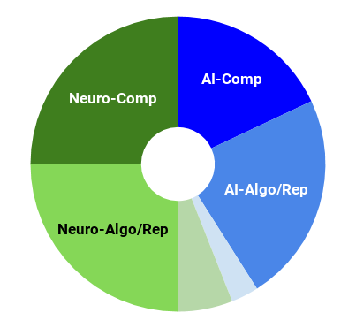
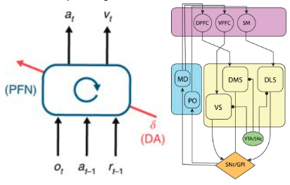

---

layout: post

title:  Reinforcement Learning with the Basal Ganglia and prefrontal cortex 

---

_This post is part of a series "Systems Neuroscience for AI: An Introductory Guide to the Literature"._

#### Guide contents
* [Introduction]()
* [Motivation: why should we pay attention to the brain for AI?]()
* [Overviews: What, broadly speaking, is the brain computing?]() 
* [The Cerebral Cortex: A Very Tangled Web]()
* [The Thalamus: More than just Central Station]()
* [The Hippocampus: A Less Tangled Web]()
* [Cortico-hippocampal interactions]()
* [Reinforcement Learning with the Basal Ganglia and prefrontal cortex]() (This page)
* [The Telencephalon: Or, How I Learned Concepts in the Cortico-thalamo-basal ganglia-hippocampal system]()
* [The ‘Little Brain’, often forgotten: the Cerebellum]()
* [The Cerebello-basal ganglia-thalamo-cortical system]()
* [Conclusions]()

 

---

 

Reinforcement learning and biology have a long and fruitful history of co-inspiration. Sutton and Barto (2018) Reinforcement Learning: An Introduction provides a good overview of this history and a good introduction to the relevant biology for AI researchers. Chapter 15 “Neuroscience”. For a gentle primer on the basal ganglia, check out this short video.

Far from fizzling out, the virtuous cycle in the intersection of reinforcement learning in artificial and biological systems continues to yield insights that would have been difficult to reveal in isolation. There is far too much recent biologically-relevant deep reinforcement learning to review adequately here. Fortunately, Neftci & Averbeck (2019) present a satisfying review of the intersection between these topics, while looking more deeply at the biology than in Sutton and Barto. 

<h3 markdown='1' style="color:#515A5A">
Reinforcement learning in artificial and biological systems

</h3>

Nature Machine Intelligence. Volume 1, pages133–143 (2019) 
Emre O. Neftci & Bruno B. Averbeck 
https://doi.org/10.1038/s42256-019-0025-4 
 
**Abstract** 
There is and has been a fruitful flow of concepts and ideas between studies of learning in biological and artificial systems. Much early work that led to the development of reinforcement learning (RL) algorithms for artificial systems was inspired by learning rules first developed in biology by Bush and Mosteller, and Rescorla and Wagner. More recently, temporal-difference RL, developed for learning in artificial agents, has provided a foundational framework for interpreting the activity of dopamine neurons. In this Review, we describe state-of-the-art work on RL in biological and artificial agents. We focus on points of contact between these disciplines and identify areas where future research can benefit from information flow between these fields. Most work in biological systems has focused on simple learning problems, often embedded in dynamic environments where flexibility and ongoing learning are important, similar to real-world learning problems faced by biological systems. In contrast, most work in artificial agents has focused on learning a single complex problem in a static environment. Moving forward, work in each field will benefit from a flow of ideas that represent the strengths within each discipline.  

 

---

 

One of my frustrations in my undergraduate exposure to the prefrontal cortex was an over-reliance on the concept of “executive function”, with no accompanying explanation of how the brain actually performed it. So much else was at least partially explained - the sensory hierarchy, the mechanisms of episodic memory, the motor system; but executive function was left undissected, thus remaining strongly homuncular. I was therefore pleased to read the following explanatory offering from Wang et al. (2018), whose essential argument is that the PFC, the primary locus of ‘executive function’, is a meta-reinforcement learning system. Although it is not strictly speaking a review article, I include it because, in my view, it provides a compelling case for a unifying functional principle of a brain area that we consider responsible for much of intelligent behaviour in humans. 

<h3 markdown='1' style="color:#515A5A">
Prefrontal cortex as a meta-reinforcement learning system

</h3>

Nature Neuroscience 21: 860–868 
Jane X. Wang, Zeb Kurth-Nelson, Dharshan Kumaran, Dhruva Tirumala, Hubert Soyer, Joel Z. Leibo, Demis Hassabis & Matthew Botvinick  
https://doi.org/10.1038/s41593-018-0147-8 
 

**Abstract** 
Over the past 20 years, neuroscience research on reward-based learning has converged on a canonical model, under which

 the neurotransmitter dopamine ‘stamps in’ associations between situations, actions and rewards by modulating the strength of synaptic connections between neurons. However, a growing number of recent findings have placed this standard model under strain. We now draw on recent advances in artificial intelligence to introduce a new theory of reward-based learning. Here, the dopamine system trains another part of the brain, the prefrontal cortex, to operate as its own free-standing learning system. This new perspective accommodates the findings that motivated the standard model, but also deals gracefully with a wider range of observations, providing a fresh foundation for future research.   

Associated talk: https://www.youtube.com/watch?v=LnXgs73OUjE

 

---

 

Following Wang et al. (2018)(above), Dasgupta et al. (2019) make the strong but exciting claim that such meta-reinforcement learning is in fact capable of causal reasoning - an indication of the large potential consequences of the above work for AI systems. We will visit further implications of Wang et al. (2018) in the next section on the telencephalon{link}. 

_Next post_: [The Telencephalon: Or, How I Learned Concepts in the Cortico-thalamo-basal ganglia-hippocampal system]({{ site.baseurl }}/Systems_Neuroscience_for_AI_Telencephalon/)

