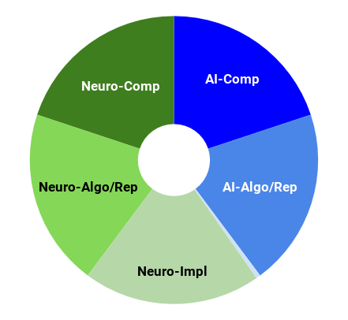

---

layout: post

title: The Telencephalon&#58; Or, How I Learned Concepts in the Cortico-thalamo-basal ganglia-hippocampal system 

---

_This post is part of a series "Systems Neuroscience for AI: An Introductory Guide to the Literature"._

* [Introduction]({{ site.baseurl }}/Systems_Neuroscience_for_AI_Introduction/)
* [Motivation: why should we pay attention to the brain for AI?]({{ site.baseurl }}/Systems_Neuroscience_for_AI_Motivation/)
* [Overviews: What, broadly speaking, is the brain computing?]({{ site.baseurl }}/Systems_Neuroscience_for_AI_Overviews/)
* [The Cerebral Cortex: A Very Tangled Web]({{ site.baseurl }}/Systems_Neuroscience_for_AI_Cerebral_Cortex/)
* [The Thalamus: More than just Central Station]({{ site.baseurl }}/Systems_Neuroscience_for_AI_Thalamus/)
* [The Hippocampus: A Less Tangled Web]({{ site.baseurl }}/Systems_Neuroscience_for_AI_Hippocampus/)
* [Cortico-hippocampal interactions]({{ site.baseurl }}/Systems_Neuroscience_for_AI_Cortico-hippocampal_interactions/)
* [Reinforcement Learning with the Basal Ganglia and prefrontal cortex]({{ site.baseurl }}/Systems_Neuroscience_for_AI_RL_with_BG_and_PFC/)
* [The Telencephalon: Or, How I Learned Concepts in the Cortico-thalamo-basal ganglia-hippocampal system]({{ site.baseurl }}/Systems_Neuroscience_for_AI_Telencephalon/) (This page)
* [The ‘Little Brain’, often forgotten: the Cerebellum]({{ site.baseurl }}/Systems_Neuroscience_for_AI_Cerebellum/)
* [The Cerebello-basal ganglia-thalamo-cortical system]({{ site.baseurl }}/Systems_Neuroscience_for_AI_CB_BG_Th_Ctx/)
* [Conclusions]({{ site.baseurl }}/Systems_Neuroscience_for_AI_Conclusions/)

 

---

 

The hippocampus, thalamus, basal ganglia, and cerebral cortex form the bulk of what is collectively called the telencephalon. Together they comprise a majority of the mass of the brain, at least in primates. Even though we’ve already looked at a number of components and subsystems, we will again need to tackle it piecewise. 

A point made most explicitly in Wang et al. (2018) and Behrens et al. (2018) (though originally made elsewhere) was that the orbitofrontal cortex probably encodes the value- or task-structure of the state. But what if the agent encounters a new object, such as a hitherto unencountered stinging insect? The agent would do well to make use of this new information, which has not had time to be assimilated into the connections of the cortex, in its state-value function that it sent to the basal ganglia to determine actions. In other words, the agent should be able to apply newly learned information appropriately for the task-structure, the ‘task’ here being the avoidance of stings. Therefore we now return to the role of the hippocampus and study how it interacts with the orbitofrontal cortex. 

<h3 markdown='1' style="color:#515A5A">
Over the river, through the woods: cognitive maps in the hippocampus and orbitofrontal cortex

</h3>

Nature Reviews Neuroscience volume 17, pages 513–523 (2016) 
Wikenheiser & Schoenbaum 
https://doi.org/10.1038/nrn.2016.56  
 
**Abstract** 

The hippocampus and the orbitofrontal cortex (OFC) both have important roles in cognitive processes such as learning, memory and decision making. Nevertheless, research on the OFC and hippocampus has proceeded largely independently, and little consideration has been given to the importance of interactions between these structures. Here, evidence is reviewed that the hippocampus and OFC encode parallel, but interactive, cognitive 'maps' that capture complex relationships between cues, actions, outcomes and other features of the environment. A better understanding of the interactions between the OFC and hippocampus is important for understanding the neural bases of flexible, goal-directed decision making.  

 

---

 

We saw in the above review that the OFC does not directly project to the hippocampus. Yet we still need a way to choose the correct hippocampal neurons to stimulate in order to recall or imagine appropriate goal-relevant memories or concepts. Indeed, a human may have a new idea and then immediately proceed to build new ideas on top of it. It isn’t clear that such multi-step feats of working memory rely solely on the cortex or corticothalamic loops; it is likely that we build on newly conceived concepts that are temporarily stored in the hippocampus. This is the first of two gaps that I feel were left by the earlier Rolls (2018) review: it does not address how memories may be selected as part of an active, goal-directed process; it only accounts for how patterns of activity in the entorhinal cortex might get stored in the hippocampus and how parts of that pattern might be sufficient to activate the whole pattern (pattern completion) - the influence of goals is unclear. Clearly, goal-directed access of hippocampal representations need involve the prefrontal cortex, but which part? And how is such influence mediated? In the last two decades, a system involving a particular nucleus of the thalamus, the nucleus reuniens, has been gathering attention on account of its mediation of this process. 

<h3 markdown='1' style="color:#515A5A">
Role of the thalamic nucleus reuniens in mediating interactions between the hippocampus and medial prefrontal cortex during spatial working memory 

</h3>

Front. Syst. Neurosci., 10 March 2015  
Amy Griffin 
https://doi.org/10.3389/fnsys.2015.00029  
 
**Abstract** 

Despite decades of research, the neural mechanisms of spatial working memory remain poorly understood. Although the dorsal hippocampus is known to be critical for memory-guided behavior, experimental evidence suggests that spatial working memory depends not only on the hippocampus itself, but also on the circuit comprised of the hippocampus and the medial prefrontal cortex (mPFC). Disruption of hippocampal-mPFC interactions may result in failed transfer of spatial and contextual information processed by the hippocampus to the circuitry in mPFC responsible for decision making and goal-directed behavior. Oscillatory synchrony between the hippocampus and mPFC has been shown to increase in tasks with high spatial working memory demand. However, the mechanisms and circuitry supporting hippocampal-mPFC interactions during these tasks is unknown. The midline thalamic nucleus reuniens (RE) is reciprocally connected to both the hippocampus and the mPFC and has been shown to be critical for a variety of working memory tasks. Therefore, it is likely that hippocampal-mPFC oscillatory synchrony is modulated by RE activity. This article will review the anatomical connections between the hippocampus, mPFC and RE along with the behavioral studies that have investigated the effects of RE disruption on working memory task performance. The article will conclude with suggestions for future directions aimed at identifying the specific role of the RE in regulating functional interactions between the hippocampus and the PFC and investigating the degree to which these interactions contribute to spatial working memory.  

 

---

 

Before considering even more global views of telencephalic function, I’ll make a passing algorithmic note on which hippocampal memories get recalled now that we’re a little more familiar with the relevant machinery. Recent experiments by Mattar and Daw (2018) suggest that there are as few as two major desiderata of which memories get recalled: gain (the increase in discounted future reward expected from a policy change at the memorised state in question) and need (how likely that memorised state is to be visited again in future given its current policy). This echoes historical RL models as well as more recent deep RL models (such as Schaul et al. 2015), which use reward-dependent criteria for memory replay. The experiments of Matter and Daw suggests that model-based prioritisation of memories based on these two criteria in particular may prove a fruitful avenue of research for deep RL, which to my knowledge is yet to be explored. 

As the brain-part tasked with coordinating novel patterns of activity throughout the cortex, it would be convenient for the hippocampus if repeated patterns could be generalised, compressed, and reused. If such a process could consolidate the pattern outside the hippocampus, it could then focus on learning new patterns that build ever more abstractly on the learned patterns. In the literature, this is the process of building conceptual ‘schema’. Before looking at what we know on the neurobiology of schema learning, the following review will take a more AI-oriented look at why schemas are important and put these slightly vague notions in a more computational frame. (Incidentally, it will also highlight the second gap in the perspective offered in Rolls (2018) taking issue with the idea that the hippocampus stores even similar experiences completely differently, thus implying that hippocampal representations may sometimes combine information from several temporally distinct but semantically related episodes.)

<h3 markdown='1' style="color:#515A5A">
What Learning Systems do Intelligent Agents Need? Complementary Learning Systems Theory Updated

</h3>

Trends in Cognitive Sciences. Vol 20, issue 7, p512-534. 1 July 2016 
Kumaran, Hassabis, & McClelland 
https://doi.org/10.1016/j.tics.2016.05.004 
 
**Abstract** 

We update complementary learning systems (CLS) theory, which holds that intelligent agents must possess two learning systems, instantiated in mammalians in neocortex and hippocampus. 

The first gradually acquires structured knowledge representations while the second quickly learns the specifics of individual experiences. We broaden the role of replay of hippocampal memories in the theory, noting that replay allows goal-dependent weighting of experience statistics. We also address recent challenges to the theory and extend it by showing that recurrent activation of hippocampal traces can support some forms of generalization and that neocortical learning can be rapid for information that is consistent with known structure. Finally, we note the relevance of the theory to the design of artificial intelligent agents, highlighting connections between neuroscience and machine learning.  

 

---

 
Now that we have a better grasp of schema learning on a computational level, we would ideally look at the algorithms used to build them in the brain. But this is currently lacking. Hence, we next take a look at the biology of schemas, which might eventually help bridge the gap to the algorithmic level. 

<h3 markdown='1' style="color:#515A5A">
Neurobiology of Schemas and Schema-Mediated Memory

</h3>

Trends in Cognitive Sciences. Vol 21 Issue 8 p618-631 
Gilboa & Marlatte 
https://doi.org/10.1016/j.tics.2017.04.013  
 
**Abstract** 

Schemas are superordinate knowledge structures that reflect abstracted commonalities across multiple experiences, exerting powerful influences over how events are perceived, interpreted, and remembered. Activated schema templates modulate early perceptual

 processing, as they get populated with specific informational instances (schema instantiation). Instantiated schemas, in turn, can enhance or distort mnemonic processing from the outset (at encoding), impact offline memory transformation and accelerate neocortical integration. Recent studies demonstrate distinctive neurobiological processes underlying schema-related learning. Interactions between the ventromedial prefrontal cortex (vmPFC), hippocampus, angular gyrus (AG), and unimodal associative cortices support context-relevant schema instantiation and schema mnemonic effects. The vmPFC and hippocampus may compete (as suggested by some models) or synchronize (as suggested by others) to optimize schema-related learning depending on the specific operationalization of schema memory. This highlights the need for more precise definitions of memory schemas.  

 

---

 

Readers seeking further biological details on schema are pointed toward Ghosh and Gilboa (2016) for detailed and historical accounts of memory schema. For an interesting, but far-from-consensus view on the role of episodic memory for long term temporal credit assignment in the brain, see Lillicrap and Santoro (2019); it takes aim at an algorithmic account of the interaction between the hippocampus and cortex and explores the relevance of backpropagation-through-time in this process. 

DeepMind in particular is pushing hard along lines that are consistent with episodic memory consolidation and memory schema. Before we move away from the telencephalon, it’s worth exploring a few more of the architectures and machine learning methods that have been developed there that are linked to schemas, memory consolidation, episodic memory, and reinforcement learning.  

We have already mentioned the non-parametric memory systems of the episodic controller (Blundell et al. 2016) and the neural cache (Grave et al. 2016)(and a more recent variant in Rae et al. 2018) when we looked at the hippocampus. Blundell et al. (2016) is in fact a reinforcement learning system that learns to take actions based on the episodes it has stored in memory. They explore in some detail on the benefits of episodic memory systems, such as the hippocampus, for RL agents. A similar architecture can be found in Pritzel et al. (2017), which rapidly assimilates new experiences, enabling much faster learning than most prior DRL agents. It uses does not learn when to write to memory; instead, it writes everything as fast-updating memory values and uses slow-changing keys and context-based lookup to learn how to access useful memory values for action selection. Arguably, this is similar to the PFC learning which memories to replay. 

One enduring proposal for hippocampal representations by Gluck and Myers (1993) is that they are predictive. Wayne et al. (2018) introduced an reinforcement learning architecture that uses a DNC-like memory to parametrize a distribution of expected future observations, thus unsupervised-learning a model of its environment. Although a long paper and complex architecture, it is among one my favourite agents to come out of DeepMind so far and is worth reading. One interesting observation tucked away at the end of the supplementary materials is the observation that many memory slots tend to be activated very close to where they were first written; it is not an argument made explicit in the paper, but it is hard to ignore the similarity to hippocampal place cells. Follow-up work (Hung et al. 2018) introduces ‘value transportation’, which uses a similar architecture to address long-term temporal credit assignment by recalling specific memories to assign credit to past actions. 

Again following the work of Wang et al. (2018), one particularly interesting approach combines episodic learning with meta-reinforcement learning, thus building a agent with components that are directly analogous to the hippocampus and prefrontal cortex (in addition to the standard analogy between encoder networks and sensory cortices). Remember from previously that the interplay between these two systems was one mode of working memory, something which might enable to human to remember and build on imagined experiences or concepts almost immediately after they have occurred (see discussion in the hippocampus section). Ritter et al. (2018a) introduces such an agent, which stores past cell states in an episodic memory (based on Pritzel et al. 2017) and incorporates the memories by passing it through a new ‘reinstatement’ gate in the agent’s modified LSTM. They claim it thus learns model-based episodic control. Further neuroscientific analysis can be found in Ritter et al. (2018b) and Ritter’s recent (Jan 2019) PhD thesis. Even more recently, Botvinick et al. (2019) explores the links of the previous works to cognitive science, in particular with regard to different rates of learning in the brain and in RL systems. 

Stepping back from RL architectures momentarily, it isn’t clear that any of the above offer a mechanism by which episodic memories can be consolidated into a set of generalised memories which can be used as a new concept in a mental ‘vocabulary’, as in schema consolidation. Methods that address this challenge directly include the work of Rae et al. (2018), which combines a gradient descent with a Hebbian softmax rule in order to stably consolidate frequently seen word classes while at the same time being able to quickly memorise new classes. An alternative approach is instead to use non-parametric episodic memories to temporarily adapt the weights (rather than the activations) of a network based on remembered context, and gradually incorporate those weight changes into the network. This approach is taken by Sprechmann et al. (2018), whose memory-based parameter adaptation method permits such learning, leading to good performance and generalisation, even when faced with imbalanced datasets and distributional shifts. 

Finally, although we have seen that the hippocampus enables imagination of new experiences and concepts by coordinating cortical activity in novel patterns, we have not seen architectures that perform comparably effective imagination. One recent step toward this end can be found in Buesing et al. (2018), whose RL agent use a pre-learned state-space model, which they learn to query in order to evaluate the value of their actions before they take them - they plan to train the state-space model at the same time as the agent in future work. Other work examines how planning behaviour might emerge from networks trained without explicit architectural biases for planning (Guez et al. 2019). 

We have partially localised functions such as imagination, working memory, attention, planning, memory consolidation, abstract concepts, and more to the telencephalon, but the AI-versed reader will be well aware that the works mentioned above only scratch the surface of AI research that aim to tackle these functions. The above brief exploration of such works - with particular focus on those from DeepMind - is intended only to illustrate the utility of organising our notions of these functions around the sole known example of general intelligence. 

 

---

 

All this brain, and what is it for? If you believe the ‘motor chauvinists’, the entire purpose of the brain is for movement (teleologically speaking, of course). Whether or not it’s true, we turn to how the brain might select actions. A gentle video introduction can be found here, which focuses primarily on the role of the basal ganglia. For a more detailed look at how the brain areas that we have discussed in previous sections interact with the basal ganglia to inform action selection, we move to our next review. 
<h3 markdown='1' style="color:#515A5A">
An Integrated Model of Action Selection: Distinct Modes of Cortical Control of Striatal Decision Making. 

</h3>

Annual Review of Psychology, 70(1). 
Sharpe, M. J., Stalnaker, T., Schuck, N. W., Killcross, S., Schoenbaum, G., & Niv, Y. (2018). 
doi:10.1146/annurev-psych-010418-102824  

 
**Abstract** 

Making decisions in environments with few choice options is easy. We select the action that results in the most valued outcome. Making decisions in more complex 

environments, where the same action can produce different outcomes in different conditions, is much harder. In such circumstances, we propose that accurate action selection relies on top-down control from the prelimbic and orbitofrontal cortices over striatal activity through distinct thalamostriatal circuits. We suggest that the prelimbic cortex exerts direct influence over medium spiny neurons in the dorsomedial striatum to represent the state space relevant to the current environment. Conversely, the orbitofrontal cortex is argued to track a subject's position within that state space, likely through modulation of cholinergic interneurons.   

_Next post_: [The ‘Little Brain’, often forgotten: the Cerebellum]({{ site.baseurl }}/Systems_Neuroscience_for_AI_Cerebellum/)

