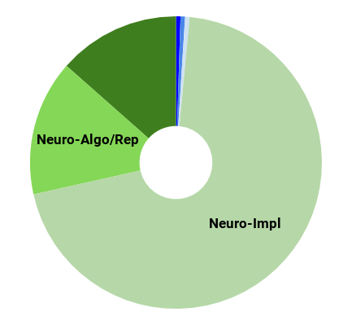
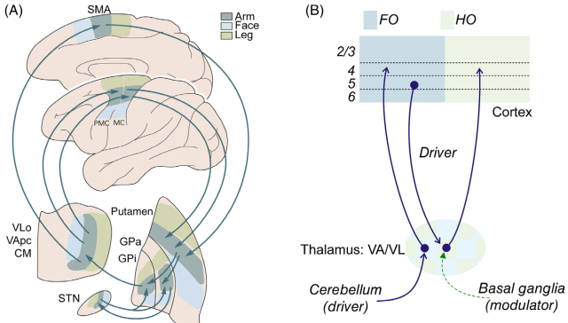
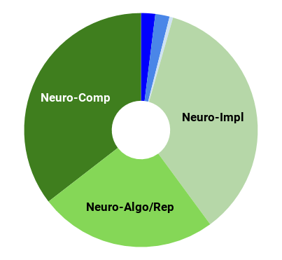
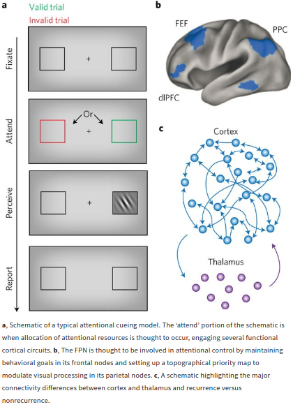

---

layout: post

title:  The Cerebral Cortex&#58; A Very Tangled Web 

---

_This post is part of a series "Systems Neuroscience for AI: An Introductory Guide to the Literature"._

#### Guide contents
* [Introduction]()
* [Motivation: why should we pay attention to the brain for AI?]()
* [Overviews: What, broadly speaking, is the brain computing?]() 
* [The Cerebral Cortex: A Very Tangled Web]()
* [The Thalamus: More than just Central Station]()(This page)
* [The Hippocampus: A Less Tangled Web]()
* [Cortico-hippocampal interactions]()
* [Reinforcement Learning with the Basal Ganglia and prefrontal cortex]()
* [The Telencephalon: Or, How I Learned Concepts in the Cortico-thalamo-basal ganglia-hippocampal system]()
* [The ‘Little Brain’, often forgotten: the Cerebellum]()
* [The Cerebello-basal ganglia-thalamo-cortical system]()
* [Conclusions]()

 

---

 

I must confess, I became interested in the thalamus for the wrong reasons. During my undergraduate years (2012, specifically), I once considered it my life goal to solve the hard problem of consciousness. I therefore delved into the ‘neural correlates of consciousness’ literature. My early mistake was to think that a sufficiently detailed understanding of the neural correlates could possibly shed light into the explanatory gap. This led me to read some  of Francis Crick’s later work (possibly this, though I cannot remember exactly where) who discussed the postulate that the thalamus might function as an attentional searchlight, selecting which cortical representations to ‘light up’, thus bringing them into awareness. The thalamus also appeared to influence working memory via corticothalamocortical loops. The link to consciousness related to the notion that we are only conscious of the stimuli of which we are aware. Consciousness aside, it was becoming clear, even then, that the thalamus exerts a possibly large influence on cortical computations. 

Although I gave up on seeking answers to the hard problem of consciousness (at least until we have machines that are better able to think about such issues…), my experience left me with a strong sympathy toward the view that, if you want to understand cortical computation, you cannot ignore the thalamus. Thus it remains a surprise to me that so much cortical computation research ignores the role of the thalamus. Thalamus researchers, lamenting its neglect, often cite that the textbook view is that it is little more than a relay station (I confirmed this is true, at least for one major 2004 neuroscience textbook, which pays lip service to the idea that the thalamus has more complex role than current consensus, but only ever discusses its function as a relay). Despite this neglect, as we will see in the reviews below that an emerging view of thalamocortical computation is that the two are basically inseparable, especially for goal-directed cognition. 

 85 [Predictive Processing: A Canonical Cortical Computation.](httks://doi.org/10.1016/j.neuron.2018.10.0    03)
 86 </h3>
 87 

<h3 markdown='1' style="color:#515A5A">
[Functioning of Circuits Connecting Thalamus and Cortex.](https://doi.org/10.1002/cphy.c160032)

</h3>

Compr Physiol. 2017 Mar 16;7(2):713-739. 
Murray S. Sherman  
https://doi.org/10.1002/cphy.c160032  

**Abstract**
_Glutamatergic pathways in thalamus and cortex are divided into two distinct classes: driver, which carries the main information between cells, and modulator, which modifies how driver inputs function. Identifying driver inputs helps to reveal functional computational circuits, and one set of such circuits identified by this approach are cortico-thalamo-cortical (or transthalamic corticocortical) circuits. This, in turn, leads to the conclusion that there are two types of thalamic relay: first order nuclei (such as the lateral geniculate nucleus) that relay driver input from a subcortical source (i.e., retina), and higher order nuclei (such as the pulvinar) which are involved in these transthalamic pathways by relaying driver input from layer 5 of one cortical area to another. This thalamic division is also seen in other sensory pathways and beyond these so that most of thalamus by volume consists of higher-order relays. Many, and perhaps all, direct driver connections between cortical areas are paralleled by an indirect cortico-thalamo-cortical (transthalamic) driver route involving higher order thalamic relays. Such thalamic relays represent a heretofore unappreciated role in cortical functioning, and this assessment challenges and extends conventional views regarding both the role of thalamus and mechanisms of corticocortical communication. Finally, many and perhaps the vast majority of driver inputs relayed through thalamus arrive via branching axons, with extrathalamic targets often being subcortical motor centers. This raises the possibility that inputs relayed by thalamus to cortex also serve as efference copies, and this may represent an important feature of information relayed up the cortical hierarchy via transthalamic circuits._ 

 

---

 
Astute readers will remember the discussion in Marblestone et al. (2017) ‘Toward an Integration of Deep Learning and Neuroscience’:
> Models like (O'Reilly and Frank, 2006; Stocco et al., 2010; Terrence Stewart, 2010) propose further that the basal ganglia can gate not just the transfer of information from motor cortex to downstream actuators, but also the transfer of information between cortical areas [by modulation of the thalamus]. 
The next review examines possible consequences if such models are true, looking closely at the role the thalamus plays in cognition and attention. 
<h3 markdown='1' style="color:#515A5A">
[Thalamic functions in distributed cognitive control](https://doi.org/10.1038/s41593-017-0020-1)
</h3>

Nature Neuroscience Volume 20, p1669–1679 (28 November 2017) 
Michael M. Halassa & Sabine Kastner  
https://doi.org/10.1038/s41593-017-0020-1  

**Abstract**
_Cognition can be conceptualized as a set of algorithmic control functions whose real-time deployment determines how an organism stores and uses information to guide thought and action. A subset of these functions is required for goal-directed selection and amplification of sensory signals—broadly referred to as attention—and for its flexible control and its interaction with processes such as working memory and decision making. While the contribution of recurrent cortical microcircuits to cognition has been extensively studied, the role of the thalamus is just beginning to be elucidated. Here we highlight recent studies across rodents and primates showing how thalamus contributes to attentional control. In addition to high-fidelity information relay to or between cortical regions, thalamic circuits shift and sustain functional interactions within and across cortical areas. This thalamic process enables rapid coordination of spatially segregated cortical computations, thereby constructing task-relevant functional networks. Because such function may be critical for cognitive flexibility, clarifying its mechanisms will likely expand our basic understanding of cognitive control and its perturbation in disease._ 

 

---

 
The role of the thalamus has directly inspired some recent AI architectures such as ThalNet (Hafner et al. 2017), in which a central network learns to route information through a set of recurrent modules - in principle like the corticothalamic system does. 

In spite of the many functions of the corticothalamic system, there are many things that it cannot do alone. One of the largest differences cited between current AI systems and humans is that humans can learn from a single instance whereas most deep learning systems generally require more than one exposure. The consensus is that the hippocampus is the major component enabling human-level episodic memory, and so we turn there next. 

_Next post_: [The Hippocampus: A Less Tangled Web]({{ site.baseurl }}/Systems_Neuroscience_for_AI_Hippocampus/)

